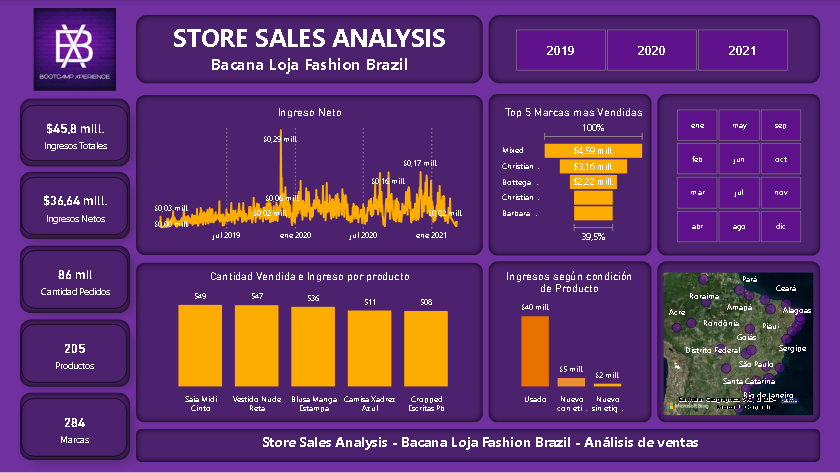

<h1 align="center"> DASHBOARD ANÁLISIS DE VENTAS</h1>
<h2>Análisis Inteligencia Empresarial</h2>

  

 

<h2>Descripción del dashboard</h2>
La tienda de moda online busca analizar sus ventas entre 2019 y 2021 para identificar tendencias, evaluar el rendimiento y planificar estrategias para mejorar la rentabilidad. El dashboard ofrece un análisis detallado de las ventas, permitiendo visualizar ingresos, cantidad de pedidos, productos más vendidos y otras métricas clave, segmentadas por años y meses.

<h2>Estado del proyecto</h2>

> 

<h2>Tecnologías utilizadas</h2>

<h2>Modelo de datos</h2>
El modelo de datos se construyó a partir de registros internos de ventas y datos geográficos. El esquema de estructura de datos incluye las siguientes tablas:
-Ventas: contiene campos marca, cantidad vendida, monto total, producto, ID de producto.
-Productos: contiene campos para el ID de producto, nombre del producto, marca y condición del producto, SKU.
-Pedidos: incluye campos fecha compra, ID de pedido, ID de producto, ID de vendedor.
-Vendedores: campos para el ID de vendedor y nombre del vendedor.
-ListaCódigos: ciudad, nombre ciudad.

<h2>Transformación de datos</h2>
Los pasos de limpieza y transformación incluyen:
- Eliminación de datos duplicados y corrección de errores en los datos de ventas, productos y ciudades.
- Creación de medidas para calcular los ingresos totales, cantidad de pedidos, cantidad de productos y cantidad de marcas.
- Segmentación de datos por año y mes para facilitar el análisis temporal.

<h2>Diseño Visual</h2>
El diseño visual del dashboard se centró en presentar información relevante sobre las ventas de manera clara y comprensible. Se implementaron los siguientes componentes visuales para alcanzar este objetivo:
-Segmentadores de datos por año y mes para análisis temporal.
-Tarjeta para mostrar los ingresos totales.
-Tarjeta para mostrar los ingresos netos.
-Tarjeta para mostrar la cantidad de pedidos.
-Tarjeta para mostrar la cantidad de productos.
-Tarjeta para mostrar la cantidad de marcas.
-Gráfico de líneas para mostrar la tendencia del ingreso neto a lo largo del tiempo.
-Gráfico de embudo para mostrar las marcas más vendidas.
-Gráfico de barras para comparar la cantidad vendida e ingreso por producto.
-Gráfico de barras para mostrar el ingreso por condición del producto.
-Gráfico de mapa para visualizar el ingreso por ciudad.

(<a href="#readme-top">back to top</a>)

<h2>Resumen</h2>
En resumen, el dashboard de análisis de ventas muestra que la empresa generó ingresos totales por 45.8 millones de reales entre 2019 y 2021. La tienda distribuye en 27 ciudades, cuenta con 5 vendedores y ofrece 205 productos. La falda midi con cinturón lidera las ventas con 549 unidades vendidas. Las ciudades de Alagoas y Pernambuco lideran en la generación de ingresos. El análisis por año y mes permite a la empresa identificar tendencias estacionales y planificar estrategias para maximizar las ventas.

(<a href="#readme-top">back to top</a>)

<h2>Desarrolladores del proyecto</h2>

[ Esteban Ferraz](https://github.com/estebanferraz1)

(<a href="#readme-top">back to top</a>)

<h2>Licencia</h2>

Este proyecto está bajo la Licencia MIT - mira el archivo LICENSE.md para detalles.

> [!CAUTION]
> 
> Utilizar con fines educativos.

(<a href="#readme-top">back to top</a>)

<h2>Contacto</h2>

Esteban Ferraz - estebanferraz@outlook.cl

(<a href="#readme-top">back to top</a>)

